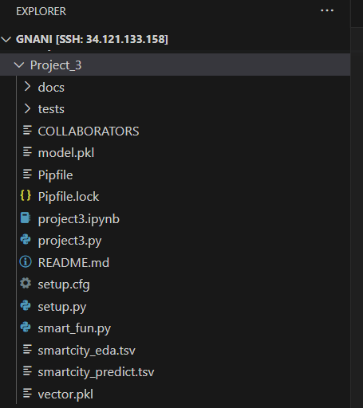

In this project, we perform the extraction of content from given pdf files of smart city and upon preprocessing, we apply serveral clustering models and display features of the content. Finally, we predict the input pdf documents cluster id.

#### Steps followed:

1. Validate if there exists required filters in the argument list. As --document mandatory, we proceed only if these parameters are passed as input through command line arguments.
2. Capture the document values which is the file name.
3. Traverse throught he complete list of pdf documents and identify the input pdf and extract it's content from the file.
4. With refference to the scripts in .ipynb file, the text pre-processing has been applied and the clean text is returned.
5. Upon validating models like (K-means, Hierarchial CLustering, DB Scan), suitable model has been chosen and a pickel file generated which helps to save the model.
6. The model has been fit with the content of all extracted pdfs in the smartcity directory.
7. We dispaly the cluster id of the input document upon applying the model.
8. A .tsv file has been generated which contains the details of city name, Initial content of the file, cleaned text and the cluster id of the city.

##### Modules and Installation

1. argparse - It helped in handling the aruments passed to the redaction program. It is used to validate the filters and their parameters, parsing the sys.argv list.

It's a python standard library.

```
        import argparse

```

2. CountVectorizer -  It is a tool available in scikit-learn library which helps to transform a given text into a vector based on the frequency (count) of each word that occurs in the entire text.

To Use :

```
        from sklearn.feature_extraction.text import CountVectorizer
```

3. json - It helps us in working with .json files - Reading, Writing and performing operations on file data.

It's a python standard library.

```
        import json

```
4. re - It helps us in working with regular expressions. It provides various functions to work with regular expressions such as matching, searching, and replacing. We used it to match Date, phone number formats.

It's a python standard library.

```
        import re

```

5. os - It helps us in dealing with operating system dependent functionality like reading or writing to the file system, creating new directories, finding current path, validating if a file or directory exists in the file system etc.

It's a python standard library.

```
        import os

```
6. train_test_split - It is a function in Sklearn library which is a part of model selection for splitting data arrays into two subsets: training data and testing data.
To Use :

```
        from sklearn.model_selection import train_test_split
```
7. SVC - It is a supervised machine learning algorithm used for classification tasks. The algorithm works by finding the hyperplane that best separates the different classes in the input data. A linear kernel can be used as normal dot product any two given observations. The product between two vectors is the sum of the multiplication of each pair of input values.
To Use :

```
        from sklearn.svm import SVC
```
8. accuracy_score - It is a function from the sklearn.metrics module in the scikit-learn library, which helps us in  calculating the accuracy of a classification model.
To Use:

```
        from sklearn.metrics import accuracy_score
```
9. cosine_similarity - It is a function from the sklearn.metrics.pairwise module in the scikit-learn library, which is used to calculate the cosine similarity between two vectors. It measures similarity between two non-zero vectors.
To Use:

```
        from sklearn.metrics.pairwise import cosine_similarity
```
10. sys - It helps us in working with some variables and functions used or maintained by the interpreter. Mainly we used it to consider sys.argv and their processing. Moreover, it helped in processing Standard input, output and error streams.

It's a python standard library.

```
        import sys

```

Please find below, more modules to be installed:

```
import subprocess
from pypdf import PdfReader
from collections import OrderedDict
import nltk
nltk.download('stopwords')
import spacy
#from contractions import CONTRACTION_MAP
from nltk.corpus import wordnet
import collections
#from textblob import Word
from nltk.tokenize.toktok import ToktokTokenizer
from bs4 import BeautifulSoup
from sklearn.feature_extraction.text import TfidfVectorizer
from sklearn.cluster import KMeans, AgglomerativeClustering, DBSCAN
from sklearn.metrics import silhouette_score, calinski_harabasz_score, davies_bouldin_score
import pandas as pd
import joblib
```


##### File Structure Snap



#### Function - "extract_input(file_name)"

Input Parameters: 

file_name -> file name (.pdf)

Return Values: name,content_list

name -> Strings formed by removing .pdf from file name
content_list -> List with a single string containing extracted content from the file

Using the file path, all pdf documents will be traversed and the one which matches with given file name is considered to extract the content using PdfReader function. Content from all pages of diocument is saved to a string. A dictionary has been created with file name as key and it's content as value.

```
        inp_path = '{}/docs/smartcity/'.format(os.path.abspath(os.getcwd()))

        files = os.listdir(inp_path)
        files_content = OrderedDict()

        for i in files:
                if i == file_name:
                name = i.split('.')[0]
                pdf_reader = PdfReader(open(inp_path+i, 'rb'))
                s = ''
                for i in pdf_reader.pages:
                        ##files_content.append(i.extract_text())
                        s+=i.extract_text()
                files_content[name] = s

        content_list = []
        for k,v in files_content.items():
                content_list.append(v)

        return name,content_list

```

This returns the the list which contains the xtracted content as string. List has been considered to pass it as parameter for the pre-processing functions.


#### Function - "normalize_corpus(content_list)"

Input Parameters: 

content_list -> List with a single string containing extracted content from the file

Return Values:

normalized_corpus -> Pro-processed content of the file which can be used to apply a model

This function helps us in preprocessing the text in the collected list by removing stop words, applying lemmatization, contraction map, stemming, removing special characters etc.

```
        [Chapter 3] [contractions.py] and [text_normalizer.py] from the .ipynb 

```

Upon pre-processing, the function retirns the list of string containing the cleaned text of the file.

#### Function - "predicting_cluster(text_str)"

Input Parameters: 

normalized_corpus -> Preprocessed list of string

Return Values:

cluster_id -> Predicted cluster id of the input document (List)

Here, TfidfVectorizer creates a matrix in which contains the scores of groups of words. The files, model.pkl - contains the k-means model creation which has been fit with the content of all pdf documents & vector.pkl - contains the data frame, df['Content'] which contains the cleaned data of all the pdf documents. These are generated by .ipynb using joblib module.

The input document has been transformed using the tfidf vectorizer and the corresponding input_vector has been used to predict the cluster_id of the file.
 
```
        vectorizer = TfidfVectorizer()

        kmeans = joblib.load('model.pkl')

        sdf = joblib.load('vector.pkl')

        inp = vectorizer.fit_transform(sdf)

        input_vector = vectorizer.transform([", ".join(text_str)])

        cluster_id = kmeans.predict(input_vector.toarray())

        return cluster_id

```

The cluster id of the file will be returned by this function. Please find the following steps performed in the main().


```
        result = OrderedDict()
        result['city'] = ",".join(f_name.split(' '))
        result['raw_text'] = content_list[0]
        result['clean_text'] = normalized_corpus[0]
        result['cluster_id'] = cluster_id[0]

        df = pd.DataFrame(result, index=range(1))

        df.to_csv('smartcity_predict.tsv', sep='\t')

        print(f_name+" clusterid: "+str(cluster_id[0]))

```

To generate a file with required details, an Ordered Dictionary has been created whcih contains (City, raw_text and clean_text, cluster id corresponding to the input file). A dataframe is generate using the ordered dictionary and "smartcity_predict.tsv" is generated using the to_csv function (Fields in the file are Tab separated). Finally, the details of file (Name of the city and it's cluster id) are displayed on the console.

Test Case Checks:
---------------

#### Function - test_read_file()

This function helps in validating the functionality of reading the input json file and check if it retruns the valid outcomes - A list of strings formed by joining the ingredients of each cuisine in the file and A list of cuisine names from the file. The assert statement validates if both of them are lists and check if their length > 0.

```
        a, b = ingredient_list, ingredient_cuisine

        assert type(a)==list and len(a)>0 and type(b)==list and len(b)>0
```
#### Function - test_normalize_text()

This function helps in validating the functionality of the text preprocessing. Here, the assert statement check if the returned object is a python list and also validates if all the strings in the ingredient_list are converted to lower case by comparing the results using islower().

```
        for i in range(len(ingredient_list)):
        ingredient_list[i] = re.sub(r'\d+','', ingredient_list[i])                            # Removing numbers from the ingredient_list
        ingredient_list[i] = re.sub(r'[^\w\s]','', ingredient_list[i])                        # Removing punctuations from the ingredient_list like (- , / ? ...)
        ingredient_list[i] = ingredient_list[i].strip()                                       # Remove trailing or ending white space characters
        ingredient_list[i] = ingredient_list[i].lower()                                       # Convert characters to lower case

        a = ingredient_list

        assert type(a)==list and sum([True for i in a if i.islower()])==len(a)
```

#### Function - test_model()

This function helps in validating the implementation of model on data from json file. Here, the feature matrices are generated from the lists of ingredients, cuisines which have been split for train and test. Then, we fit the model with train data and predicted the cuisine name for the given list of input ingredients. Finally, we calculated cosine similarity to find the closeness of cuisines to the predicted result. Also, we considered a list to capture the nearest cuisines with scores in descending order. Assert statement validates if the cuisine predicted is in list of cuisines from the json file and checks if accuracy score is a float type object and validates if the list retured which helps in predicting closest cuisines.

```
        for i in data:
                collect.append(cosine_similarity(vect_str, vectorizer.transform([", ".join(i["ingredients"])]))[0][0])
                closer.append((i["id"], cosine_similarity(vect_str, vectorizer.transform([", ".join(i["ingredients"])]))[0][0]))

        assert (res[0] in ingredient_cuisine) and type(score)==float and type(closer)==list and len(closer) > 0
```

#### Function - nearest_cusines()

This function helps in validating the functionality of closest cuisines. Here, the list of tuples is sorted based on the cosine similarity scores in descending order. Based on n value, we return the top 'n' cuisines with highest similarity score from the total list of findings. Using assert statement, we check if the retruned outcome is a list with length > 0.

```
        sorted_list = sorted(closer, key=lambda x: x[1], reverse= True)

        a = sorted_list[1 : (int(n)+1)]

        assert len(a) > 0 and type(a)==list
```


### Execution:

Import, install all the required modules and packages

We provide the arguments (N & ingredients) as input through command prompt. If a parameter isn't available for the --N  or --ingredient flags, error message is returned.

We run the application using the below command:

Command - 

```
        pipenv run python project2.py --N 5 --ingredient wheat --ingredient salt --ingredient "black pepper" --ingredient oil

```

```

        pipenv run python project2.py --N 5 --ingredient onions --ingredient garlic --ingredient "garlic powder" --ingredient "olive oil" --ingredient cucumber
```


Output - The json formatted string which has the details of predicted cuisine name with it's similarity score and the dictionary of cuisine id and it's corresponding cosine similarity score.


##### Assumptions:

1. SVC - linear kernel has been considered. For the above dataset and train_size, accuracy_score is around (0.7734). The accuracy may vary with the model and random_state and test_size parameters.

2. As the given data is related to ingredients and their details, I haven't considered removal of stop words and performing lemmatization as part of text normalization. This may be required while working with other datasets.

3. The ingredients from input and json file are joined using ', ' so that we can make accurate analysis when there are ingredients with multiple words.

4. CountVectorizer has been used to cconvert the text to numbers and geneate the feature matrices.

5. train_test_split() has been used with test_size = 0.25 and random_state=42.

6. Input ingredients string has been transformed and used to predict the outcome from the model.

7. To find the similarity score, cosine similarity has been considered. This has been calculated between the input ingredient string and string of ingredients from each cuisine of the dataset file. The maximum score has been specified with the predicted cuisine name.

8. To calculate the top n closest cuisines, cosine similarity scores have been considered which are sorted in descending order of their scores and captured corresponding cuisine ids.

9. Scores are rounded to 5 decimal points. So, there may be variation in score representation if the adjacent scores have minimal difference in other decimal places.

10. dumps() from json has been used to convert the dictionaries to json object. It takes around 6 minutes to implement the model and get the result.


#### Test Case Run:

```
import pytest
pipenv run python -m pytest

```

Output - It returns the status of test checks based on assert conditions mentioned in the test_*.py files

Execution Sample Gif:

